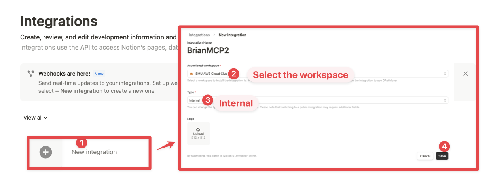
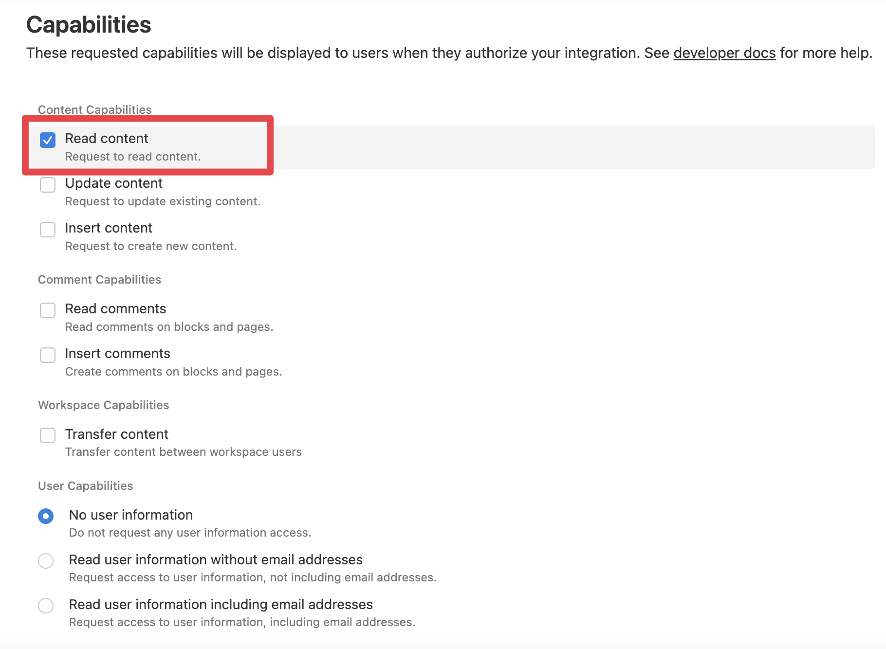

# Notion Summary Automation

A powerful CLI tool that automates the process of extracting information from presentations, analyzing them using LLMs, and creating structured summaries in Notion.

## 🚀 Features

- Extract and process content from various presentation formats (PDF, PPTX)
- Intelligent content analysis using LLMs via LangChain
- Automated Notion page creation with structured summaries
- Command-line interface for easy interaction


## 🛠️ Installation

1. Clone the repository:
```bash
git clone https://github.com/yourusername/notion-summary-automation.git
cd notion-summary-automation
```

2. Create and activate a virtual environment:
```bash
python -m venv .venv
source .venv/bin/activate  # On Windows, use `.venv\Scripts\activate`
```

3. Install dependencies:
```bash
pip install -r requirements.txt
```

## ⚙️ Configuration

1. Configure the API key for open ai 

```bash
export OPENAI="your-api-key-here"
```

2. Configure Notion notion exporter 
    To create a Notion integration, follow these steps:

    

   1. Click "New integration"
   2. Select the workspace
   3. Set the type to "Internal"
   4. Click "Save"

3. While we limit the scope of Notion API's exposed (for example, you will not be able to delete databases via MCP), there is a non-zero risk to workspace data by exposing it to LLMs. Security-conscious users may want to further configure the Integration's Capabilities.
For example, you can create a read-only integration token by giving only "Read content" access from the "Configuration" tab:




## 🚀 Usage

Basic usage:
```bash
python cli/main.py process --file path/to/presentation.pdf
```

For more options:
```bash
python cli/main.py --help
```

## 📁 Project Structure

```
notion-summary-automation/
├── cli/            # Command-line interface implementation
├── src/            # Core functionality
├── tests/          # Test files
├── requirements.txt # Project dependencies
└── README.md       # This file
```

## 🤝 Contributing

Contributions are welcome! Please feel free to submit a Pull Request.

## 📝 License

This project is licensed under the MIT License - see the LICENSE file for details.

## 🙏 Acknowledgments

- [LangChain](https://github.com/hwchase17/langchain) for LLM orchestration
- [Notion API](https://developers.notion.com/) for Notion integration
- All other open-source libraries used in this project


